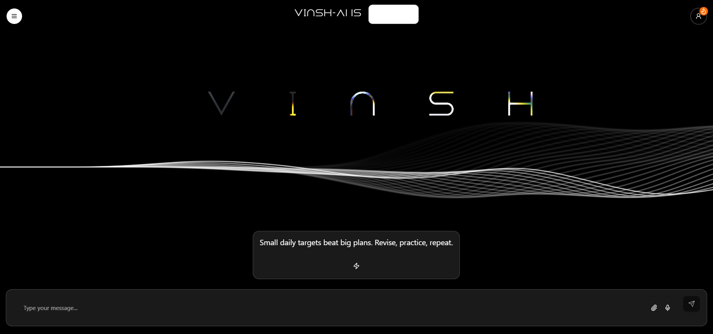

# VinshAI
## Overview

VinshAI is an educational web application designed to enhance learning and academic productivity. It provides tools for study planning, quizzes, AI-assisted learning, and interactive dashboards to help students manage their studies efficiently.

## Deployment

Due to unforeseen circumstances, we were unable to deploy on time. In the rush, I mistakenly pasted the GitHub repository link in the deployment section. I sincerely apologize for this oversight and any inconvenience it may have caused. Kindly consider the repository link provided, and I am also sharing the deployment link below for your reference. Your understanding is greatly appreciated.

#### Deployment-Link
```bash
https://vinsh-ai.vercel.app/#homevinsh
```

## Features

AI Study Assistant: Interactive AI tool to help with queries, explanations, and study guidance.

Quizzes & Assessments: Test knowledge and track progress with dynamic quizzes.

Study Planner & Dashboard: Plan study schedules, track subjects, and monitor learning progress.

Interactive UI Components: Modern, responsive, and engaging interface for a seamless learning experience.

## Project Structure
```
/SamadhanPrototype
│
├── backend/                 # Server-side logic and API endpoints
├── fonts/                   # Custom fonts used in the application
├── vinsh-ai/                # Frontend AI-driven modules and educational tools
├── c/                       # C programming utilities (if any)
├── package.json             # Project metadata and dependencies
├── package-lock.json        # Exact versions of project dependencies
└── .gitignore               # Files and directories ignored by Git                    
```
## Setup Instructions

Clone the Repository
```bash
git clone https://github.com/NamanTiwari2626/SamadhanPrototype.git
cd SamadhanPrototype
```

Install Dependencies
```bash
npm install
```

### Environment Configuration

Create a .env file in the root directory.

Add any necessary environment variables (refer to .env.example).

### Run the Application

Start the backend server:

```bash
npm start
```

Start the frontend (if using a dev server):
```bash
npm run dev
```

Open your browser at http://localhost:3000.

### Usage

Use the AI assistant to clarify concepts or get learning suggestions.

Take quizzes to assess knowledge.

Use the study planner and dashboard to organize your learning schedule.

## Screenshots

### Homepage


### Quiz Page


### Community Chat


## Contributing

We welcome contributions to improve the platform:

Fork the repository.

Create a branch for your feature or fix.

Commit your changes.

Push to your fork and submit a pull request.

Make sure your contributions follow coding standards and enhance the learning experience.

